# Context Inspector

Context Inspector is a proposed local GUI that combines:

- an interactive browser terminal connected to the real Claude CLI running in
  the existing agent container; and
- a live inspector that compares every captured model request with its
  predecessor and shows the context block by block: what was **added**,
  **removed**, **transformed**, and **retained**.

As the interaction proceeds, each model call appears beside the Claude console
with its request-context diff. When that call finishes, the same card gains its
correlated model response and measured context usage. The unit is deliberately
a model call rather than a user turn: Claude Code may issue additional calls
for tools, title generation, subagents, or other harness work.

The comparisons come from traffic observed independently by the mitmproxy
sidecar; they are not reconstructed from the terminal transcript.

Implementation code lives exclusively under `src/`. Project state and design
records follow the filesystem-native work ledger indexed by [`PLAN.md`](PLAN.md).

## Architecture

```mermaid
flowchart LR
    subgraph Browser[Browser on the host]
        Terminal[xterm.js Claude terminal]
        Viewer[Context diff, response, and usage viewer]
    end

    subgraph Application[Loopback Context Inspector application]
        Server[Python ASGI server]
        PTY[PTY session manager]
        Deriver[Evidence-aware context projection]
        Runner[Runtime orchestration script<br/>src/runtime/run.sh]
        PodmanEngine[Podman engine]
    end

    subgraph Podman[Private Podman network]
        Agent[Agent container<br/>real Claude CLI]
        Proxy[mitmproxy sidecar<br/>live-capture addon]
    end

    subgraph LocalState[Local state]
        Workspace[Selected workspace]
        ClaudeState[Persistent Claude state<br/>.state/claude]
        Events[Versioned live events<br/>events.jsonl]
        Runtime[Private runtime material<br/>CA, ADC copy, logs, captures]
    end

    Vertex[Google Vertex AI<br/>Claude endpoint]
    HostADC[Host Google ADC]

    Terminal <-->|keystrokes, resize, and raw terminal bytes<br/>terminal WebSocket| Server
    Viewer <-->|derived-context WebSocket| Server
    Server <-->|PTY input and output| PTY
    PTY <-->|stdin and stdout of run.sh| Runner
    Runner -->|requests foreground agent lifecycle| PodmanEngine
    Runner -->|requests detached proxy lifecycle| PodmanEngine
    Runner <-->|foreground podman attach| PodmanEngine
    PodmanEngine <-->|container TTY| Agent
    PodmanEngine -->|runs detached sidecar| Proxy
    Runner -.->|exit trap requests proxy removal| PodmanEngine

    Agent ==>|model HTTPS through configured proxy| Proxy
    Proxy ==>|forwarded model HTTPS| Vertex
    Vertex ==>|streaming model response| Proxy
    Proxy ==>|proxied response| Agent

    Proxy -.->|addon emits request, response, and lifecycle evidence| Events
    Events -.->|tailed by flow and context projections| Deriver
    Deriver -.-> Server
    Proxy -.->|completed archives and diagnostics| Runtime

    Workspace -->|read-write mount| Agent
    ClaudeState -->|persistent user configuration and memory mount| Agent
    Runtime -->|generated CA trust mount| Agent
    HostADC -->|copied into private runtime state| Runtime
    Runtime -->|read-only ADC mount| Agent

    classDef ui fill:#e8f1ff,stroke:#3b6ea8,color:#17324d;
    classDef service fill:#eef7ea,stroke:#4f7d3b,color:#24391b;
    classDef container fill:#fff3df,stroke:#a66b19,color:#513508;
    classDef storage fill:#f4efff,stroke:#7256a3,color:#302247;
    classDef external fill:#fdecec,stroke:#a44f4f,color:#4d2020;
    class Terminal,Viewer ui;
    class Server,PTY,Deriver,Runner,PodmanEngine service;
    class Agent,Proxy container;
    class Workspace,ClaudeState,Events,Runtime,HostADC storage;
    class Vertex external;
```



The terminal path remains the real Claude CLI: xterm.js sends keystrokes and
resize messages over a terminal WebSocket, while the server relays unmodified
PTY bytes in the opposite direction. That PTY is attached through the
foreground `podman run` client to the agent container's TTY. The browser does
not call a model SDK. Independently, all model HTTPS crosses the proxy sidecar.
Its addon records exact wire evidence and lifecycle events, which the server
projects into the interpreted context view without replacing the raw capture.

## Run the current prototype

From this directory:

```bash
cp .env.example .env
# Edit .env with your local provider configuration.
./src/bin/context-inspector
```

The launcher requires and sources `.env` from this project root; it does not
search parent directories. It then builds the browser bundle if needed and
starts the server on `http://127.0.0.1:8765`. Open that URL and use
**Start Claude** to launch the existing two-container runner under the browser
terminal's PTY.

The active session ID is retained in browser storage. Refreshing or navigating
back to the page reconnects to the same live Claude process and replays its
available terminal and context history. Closing the page only detaches the
browser; use **Stop** to terminate Claude and its containers. Restarting the
Context Inspector server still shuts down all server-owned sessions.

The context pane connects to a derived context WebSocket and presents one
structural comparison per model request. Added, removed, transformed, and
retained blocks remain expandable to exact captured request fields. The raw
flow WebSocket and completed archives remain independent evidence paths. Drag
the divider—or focus it and use the left/right arrow keys—to resize the panes.

The utilization meter defaults to a configured 200,000-token window. Override
that denominator for a different enabled model/window configuration:

```bash
CONTEXT_INSPECTOR_CONTEXT_WINDOW_TOKENS=1000000 ./src/bin/context-inspector
```

The numerator comes from wire-observed response usage; the application does
not estimate tokens from request bytes.

Claude's private user configuration persists across disposable agent
containers under this project's ignored `.state/claude` directory. The runner
does not write this state outside the project. It may contain sensitive account,
project, history, or preference metadata and must remain uncommitted.
Project-local `.claude/` instructions remain separate.

For a harmless terminal-only test that does not start Podman or Claude, set
`CONTEXT_INSPECTOR_COMMAND_JSON` to a JSON argv array before launching.
