# Context Inspector

Context Inspector is a proposed local GUI that combines:

- an interactive browser terminal connected to the real Claude CLI running in
  the existing agent container; and
- a live inspector that compares every captured model request with its
  predecessor and shows the context block by block: what was **added**,
  **removed**, **transformed**, and **retained**.

As the interaction proceeds, each model call appears beside the Claude console
with its request-context diff. When that call finishes, the same card gains its
correlated model response and measured context usage. The unit is deliberately
a model call rather than a user turn: Claude Code may issue additional calls
for tools, title generation, subagents, or other harness work.

The comparisons come from traffic observed independently by the mitmproxy
sidecar; they are not reconstructed from the terminal transcript.

Implementation code lives exclusively under `src/`. Project state and design
records follow the filesystem-native work ledger indexed by [`PLAN.md`](PLAN.md).

## Architecture

```mermaid
flowchart LR
    subgraph Browser[Browser on the host]
        Terminal[xterm.js Claude terminal]
        Viewer[Context diff, response, and usage viewer]
    end

    subgraph Application[Loopback Context Inspector application]
        Server[Python ASGI server]
        PTY[PTY session manager]
        Deriver[Evidence-aware context projection]
        Runner[Runtime orchestration script<br/>src/runtime/run.sh]
        PodmanEngine[Podman engine]
    end

    subgraph Podman[Private Podman network]
        Agent[Agent container<br/>real Claude CLI]
        Proxy[mitmproxy sidecar<br/>live-capture addon]
    end

    subgraph LocalState[Local state]
        Workspace[Selected workspace]
        ClaudeState[Persistent Claude state<br/>.state/claude]
        Events[Versioned live events<br/>events.jsonl]
        Runtime[Private runtime material<br/>CA, ADC copy, logs, captures]
    end

    Vertex[Google Vertex AI<br/>Claude endpoint]
    HostADC[Host Google ADC]

    Terminal <-->|keystrokes, resize, and raw terminal bytes<br/>terminal WebSocket| Server
    Viewer <-->|derived-context WebSocket| Server
    Server <-->|PTY input and output| PTY
    PTY <-->|stdin and stdout of run.sh| Runner
    Runner -->|requests foreground agent lifecycle| PodmanEngine
    Runner -->|requests detached proxy lifecycle| PodmanEngine
    Runner <-->|foreground podman attach| PodmanEngine
    PodmanEngine <-->|container TTY| Agent
    PodmanEngine -->|runs detached sidecar| Proxy
    Runner -.->|exit trap requests proxy removal| PodmanEngine

    Agent ==>|model HTTPS through configured proxy| Proxy
    Proxy ==>|forwarded model HTTPS| Vertex
    Vertex ==>|streaming model response| Proxy
    Proxy ==>|proxied response| Agent

    Proxy -.->|addon emits request, response, and lifecycle evidence| Events
    Events -.->|tailed by flow and context projections| Deriver
    Deriver -.-> Server
    Proxy -.->|completed archives and diagnostics| Runtime

    Workspace -->|read-write mount| Agent
    ClaudeState -->|persistent user configuration and memory mount| Agent
    Runtime -->|generated CA trust mount| Agent
    HostADC -->|copied into private runtime state| Runtime
    Runtime -->|read-only ADC mount| Agent

    classDef ui fill:#e8f1ff,stroke:#3b6ea8,color:#17324d;
    classDef service fill:#eef7ea,stroke:#4f7d3b,color:#24391b;
    classDef container fill:#fff3df,stroke:#a66b19,color:#513508;
    classDef storage fill:#f4efff,stroke:#7256a3,color:#302247;
    classDef external fill:#fdecec,stroke:#a44f4f,color:#4d2020;
    class Terminal,Viewer ui;
    class Server,PTY,Deriver,Runner,PodmanEngine service;
    class Agent,Proxy container;
    class Workspace,ClaudeState,Events,Runtime,HostADC storage;
    class Vertex external;
```



The terminal path remains the real Claude CLI: xterm.js sends keystrokes and
resize messages over a terminal WebSocket, while the server relays unmodified
PTY bytes in the opposite direction. That PTY is attached through the
foreground `podman run` client to the agent container's TTY. The browser does
not call a model SDK. Independently, all model HTTPS crosses the proxy sidecar.
Its addon records exact wire evidence and lifecycle events, which the server
projects into the interpreted context view without replacing the raw capture.

## Run the current prototype

From this directory:

```bash
python3 -m venv .venv
.venv/bin/python -m pip install -e '.[dev]'
cp .env.example .env
# Edit .env with your local provider configuration.
./src/bin/context-inspector
```

The launcher uses the project-local `.venv` and the dependencies declared in
the root `pyproject.toml`.

The launcher requires and sources `.env` from this project root; it does not
search parent directories. It then builds the browser bundle if needed and
starts the server on port `8765`, bound to all host interfaces by default. Open
`http://<server-ip>:8765` from the other machine and use **Start Claude** to
launch the existing two-container runner under the browser terminal's PTY.
New sessions default to `claude-haiku-4-5`; set `CONTEXT_INSPECTOR_MODEL` in
`.env` to override it. Restart the server to reload configuration.
This is an unauthenticated local administration tool; use a firewall or SSH
tunnel if the server network is not fully trusted. Set
`CONTEXT_INSPECTOR_HOST=127.0.0.1` in `.env` to restore loopback-only binding.

All browsers discover and join the same active Claude session, including fresh
profiles and connections through another hostname. Idle pages check every three
seconds; **Start Claude** reuses a running session instead of spawning another.
Each viewer receives live terminal output and replays available terminal and
context history. Terminal input and **Stop** affect the shared session for everyone.
Closing a page only detaches that browser. **Clear history**, scrolling, and
expanded cards remain local to each browser. Restarting the Context Inspector
server still shuts down all server-owned sessions.

Claude's working directory `/workspace` is a read/write bind mount of this
project's `./workspace` directory, created automatically if missing. It does
not mount the parent directory or sibling projects by default. Workspace contents
are ignored by Git. An explicit `CONTEXT_INSPECTOR_WORKSPACE` can select another
existing directory. Changing this setting requires restarting the server and
starting a new Claude container; existing container mounts do not change.

The context pane connects to a derived context WebSocket and presents one
structural comparison per model request. Added, removed, transformed, and
retained blocks remain expandable to exact captured request fields. The raw
flow WebSocket and completed archives remain independent evidence paths. Drag
the divider—or focus it and use the left/right arrow keys—to resize the panes.

Request cards show readable block content, labeled before/after changes, and
model reply text. Large blocks offer a preview and full-content disclosure;
each card also displays its exact `comparison_lineage` as **Comparison group**.
That key selects its comparison history within this capture session; it is not
necessarily a unique conversation or confirmed agent identifier. Collapsed repeat
groups display the key too.
thinking, attribution, raw evidence and token accounting have separate disclosures.
Adjacent matching requests collapse into a group with every request still
inspectable. Visible request numbers count displayed requests; wire event sequence
numbers remain in evidence. “No captured response available” does not imply that
a request is still running. While reading older content, new traffic leaves your
scroll position in place and offers **Jump to latest**.

The context stream has its own connection status. It automatically reconnects
and replays missed updates without duplicating cards; the terminal connection
status is independent.

With the summary API available, refresh loads the latest 25 request summaries
newest first. **Load older requests** retrieves earlier pages. Expand **Inspect
changes & request evidence** or **Read full reply & response evidence** to fetch
the complete per-request content. Request inspection opens a full-width in-app
`Request #N` tab defaulting to the full payload diff. Its × button closes it; Live session
stays pinned and connected, with a new-request badge during background activity.
Opening the same request selects its existing tab and preserves the selected view.
The default is a complete GitHub-style unified diff: red/green lines, before/after line numbers,
and Previous/Next change navigation. It compares pretty-printed decoded JSON
bodies with the recorded baseline; unchanged lines remain visible without
expanding blocks. This is not a byte-for-byte wire-format diff. Missing baseline
evidence is reported explicitly, and very large edits may be shown as a labelled
replacement region to keep computation bounded. **Block inspection** switches to
optional side-by-side block changes; **Full payload diff** returns to the diff.
The baseline is fetched when opening a request tab, not while loading live cards.
The left-hand **Payload outline** navigates JSON fields, message indices/roles,
and tool names. Click a label to jump to its diff row; expand its disclosure arrow
to browse nested fields. **After / Before** selects which payload to navigate,
including removed fields in Before. Indices are positions, not message identities.
Large branches load 100 outline entries at a time; no diff lines are hidden.
On narrow screens the outline sits above the diff.
**Previous/Next change** also selects and reveals the corresponding outline
entry, choosing Before for a removed row and After for an added row.
Arrow keys select tabs and
Delete closes a selected request tab. Tabs are local to this page and reset on
refresh; closed requests can be reopened from their cards. Initial previews are not substitutes for exact
capture. The server builds its context index once per session and shares it across
browsers; the first scan may take longer than subsequent refreshes. The browser
falls back to full replay when connected to an older server without this API.

The utilization meter defaults to a configured 200,000-token window. Override
that denominator for a different enabled model/window configuration:

```bash
CONTEXT_INSPECTOR_CONTEXT_WINDOW_TOKENS=1000000 ./src/bin/context-inspector
```

The numerator comes from wire-observed response usage; the application does
not estimate tokens from request bytes.

Claude's private user configuration persists across disposable agent
containers under this project's ignored `.state/claude` directory. The runner
does not write this state outside the project. It may contain sensitive account,
project, history, or preference metadata and must remain uncommitted.
Project-local `.claude/` instructions remain separate.

The runner installs the capture proxy's public CA into each agent/probe
container's system trust store before starting its command. Ordinary Git and
curl HTTPS commands work through the proxy with TLS verification enabled.
Only container-local trust files change; the host trust store is untouched.
Startup briefly runs as container root, then drops to UID/GID 1000 and restores
the agent account's home before executing Claude. Node retains its extra-CA
setting. Custom agent images must include `update-ca-certificates`, `setpriv`,
`getent`, `install`, and a UID/GID 1000 account. Other tools using private CA
bundles may require separate configuration.

For a harmless terminal-only test that does not start Podman or Claude, set
`CONTEXT_INSPECTOR_COMMAND_JSON` to a JSON argv array before launching.
