# Context Inspector

Context Inspector is a proposed local GUI that combines:

- an interactive browser terminal connected to the real Claude CLI running in
  the existing agent container; and
- a live inspector that compares every captured model request with its
  predecessor and shows the context block by block: what was **added**,
  **removed**, **transformed**, and **retained**.

As the interaction proceeds, each model call appears beside the Claude console
with its request-context diff. When that call finishes, the same card gains its
correlated model response and measured context usage. The unit is deliberately
a model call rather than a user turn: Claude Code may issue additional calls
for tools, title generation, subagents, or other harness work.

The comparisons come from traffic observed independently by the mitmproxy
sidecar; they are not reconstructed from the terminal transcript.

Implementation code lives exclusively under `src/`. Project state and design
records follow the filesystem-native work ledger indexed by [`PLAN.md`](PLAN.md).

## Clean startup

Every normal stack launch permanently clears the following entries under
`container/home/evaluator/.claude/` **before** starting MLflow and the app:

- `projects/`, `agent-memory/` — old transcripts, subagent transcripts and memories
- `history.jsonl`, `file-history/` — prompt history and rewind checkpoints
- `sessions/`, `session-env/`, `shell-snapshots/` — previous session state
- `cache/`, `debug/`, `plans/`, `tasks/`, `todos/`, `paste-cache/`, `image-cache/`

**The reset creates no backups or archives.** Startup prints each removed top-level
entry. Deletion cannot be undone. Stop the previous stack and let Claude exit
before launching again: cleanup refuses a live/paused container using that home
and holds a lock to prevent concurrent stack instances. Filesystem/symlink safety
checks fail closed; a failed deletion aborts startup rather than serving a
partially reset session.

Settings, credentials, installed plugins, authored instructions/skills, unknown
entries, sibling `.claude.json`, and `container/workspace/` are preserved. This
is not a workspace or factory reset: instructions/memory stored in custom
locations or plugins remain. The MLflow plugin lives outside the cleared paths;
new transcripts are created normally and remain available throughout each new
session for its Stop hook. Browser refreshes and new sessions within the same
stack do not repeat the reset. Direct ASGI use and non-Claude command overrides
do not run this startup reset.

## MLflow tracing

`src/bin/context-inspector` also starts a disposable MLflow container, waits for
its health endpoint, then starts the inspector. Open **http://127.0.0.1:5000**
on the host to use MLflow's own UI. New Claude sessions automatically export
completed turns into the **Claude Code** experiment. No host MLflow Python
dependency or manual `/mlflow-tracing:setup` is needed.

On first tracing-enabled startup the stack installs the locked
`@mlflow/claude-code@0.4.0` package locally and builds a cached derived agent image
adding Node 24.21.0. Your original `AGENT_IMAGE` is unchanged. The official hook
bundle and a small timeout adapter are mounted read-only in the agent; no hooks
or experiment IDs are written into your existing Claude settings. The adapter
runs the upstream Stop hook with a 30-second deadline and 5-second kill grace.
MLflow and Claude use the same private Podman network; tracking traffic bypasses
the MITM proxy and uses the unique MLflow container hostname, not the host port.

**Restart the stack and create a new Claude session to activate tracing.** Finish
a turn, then open MLflow → Claude Code → Traces. The pinned plugin exports at
Claude's Stop event (when it finishes responding); you need not exit Claude.
Traces carry Claude's session ID and available tool IDs/subagent structure.
These are transcript-derived views, not exact model payloads: timings/costs may
be estimated and some auxiliary model requests are absent. The inspector's wire
captures and request-number comparisons are unchanged; span-to-request joining
is not implemented yet. Model pricing uses the package's bundled snapshot, with
remote catalog fetching disabled.

Interrupted/error turns, disabled hooks or an unavailable tracking server can
leave missing traces. Hook failures are best-effort and do not block Claude;
timeouts print a warning. To inspect traces, keep the stack running—shutdown
removes MLflow data. Traces contain sensitive prompts, responses and tool results;
there is no authentication on the development tracking server.

The official `ghcr.io/mlflow/mlflow:v3.16.0` image is pulled on first use and cached.
SQLite metadata and artifacts live only inside the new container: **all MLflow
data is discarded when the stack stops**. Every stack launch creates a new
container; browser refreshes and new Claude sessions do not reset it. There are
no workspace, Claude home, credential, or data-volume mounts in MLflow.

Optional `.env` settings:

- `CONTEXT_INSPECTOR_MLFLOW_ENABLED=0` skips MLflow entirely (default `1`).
- `CONTEXT_INSPECTOR_MLFLOW_TRACING_ENABLED=0` keeps MLflow but disables automatic
  Claude tracing and skips the Node/plugin setup (default `1`).
- `CONTEXT_INSPECTOR_MLFLOW_EXPERIMENT_NAME='My Experiment'` changes the experiment
  name (default `Claude Code`); its ID is recreated on every stack launch.
- `CONTEXT_INSPECTOR_MLFLOW_PORT=5001` changes its host port (default `5000`).
- `CONTEXT_INSPECTOR_MLFLOW_IMAGE=...` overrides the pinned image.
- For access from another machine, set `CONTEXT_INSPECTOR_MLFLOW_HOST=0.0.0.0`
  and `CONTEXT_INSPECTOR_MLFLOW_ALLOWED_HOSTS=localhost:*,127.0.0.1:*,YOUR_HOST:5000`
  plus `CONTEXT_INSPECTOR_MLFLOW_CORS_ALLOWED_ORIGINS=http://localhost:*,http://127.0.0.1:*,http://YOUR_HOST:5000`
  using your actual hostname/IP and port. Both lists are required: without the
  browser-origin allowance, the page loads but chart POSTs return 403. Add each
  hostname/IP you use, with the correct URL scheme in the origin list.
  MLflow is unauthenticated: expose it
  only to a trusted network. Alternatively use an SSH tunnel to the loopback port.

Ctrl-C/normal shutdown removes the owned container. Startup failure also cleans
it up and prevents the app from starting. If the process is forcibly killed or
the machine loses power, an orphan may remain: inspect `podman ps -a` and remove
only the exact `context-inspector-mlflow-...` name printed at launch. A new stack
never reuses or deletes another launch's container; an occupied port fails startup.
Direct ASGI `create_app()` use does not provision MLflow; use the normal launcher
or `python -m src.server` for the full stack.

Reproducible disposable-container smoke tests (free ports, isolated fake model,
no real model credentials/calls or user-state mounts):

```bash
CONTEXT_INSPECTOR_TEST_MLFLOW=1 .venv/bin/python -m unittest src.tests.test_mlflow.MLflowContainerTests src.tests.test_claude_mlflow.ClaudeMLflowContainerTests
```

Configuration follows MLflow's [official image documentation](https://mlflow.org/docs/latest/ml/docker/)
and [Claude tracing guide](https://mlflow.org/docs/latest/genai/tracing/integrations/listing/claude_code/).
Export timing is verified against the pinned Stop-hook implementation and
[Claude's hook semantics](https://code.claude.com/docs/en/hooks-guide), which are
more specific than the MLflow guide's session-end wording.

## Dynamic MCP tool experiment

New Claude sessions launch a Python **stdio** MCP server named `mcp-dump`.
It is a persistent subprocess, not an HTTP server; no port is opened and no
additional Python dependencies are needed. The runtime mounts its source
read-only and supplies `--mcp-config`, without replacing other MCP settings.
Set `CONTEXT_INSPECTOR_MCP_DUMP_ENABLED=0` to omit it on the next session.

After the initial stack restart, check `/mcp` for `mcp-dump`. Edit this host file:

```text
container/workspace/.context/mcp-dump/config.json
```

Claude sees the same file at `/workspace/.context/mcp-dump/config.json`:

```json
{
  "tool_count": 1,
  "description_words": 200,
  "schema_properties": 20,
  "seed": 42
}
```

Change `tool_count` to `1000` and save. The script polls once per second and
sends `notifications/tools/list_changed` over stdout; Claude can then refresh
the inventory without a restart. Decrease the count to remove tools, or use
`0` for an empty inventory. Invalid/partial edits and temporary file removal keep
the previous valid list. If startup finds an invalid file, the list stays empty
until corrected. A missing file is created with the one-tool default only at
server startup; an existing file is never overwritten. Workspace configuration
survives the stack's Claude-history cleanup.

All four keys are required, and values must be integers. Limits: `tool_count`
0–10,000; `description_words` 0–2,000; `schema_properties` 0–100; `seed`
0–4,294,967,295. Each optional string property has 16 random description words.
A conservative 64 MB aggregate-metadata estimate also bounds combinations.
Tools have stable names (`dump_tool_00001`, etc.) and seeded content; changing
only the count leaves surviving definitions identical. Calls validate their
arguments and return a short synthetic success without side effects or argument
echoing. Listings are paginated in groups of 100, and configuration changes
invalidate old cursors.

Compare `/mcp` and captured requests before/after edits. **Advertised tools are
not necessarily model-loaded schemas:** Claude's tool search may defer them,
and removing a tool does not erase old conversation content. This experiment
does not alter Claude's tool-search or context-budget settings.

Run the script directly for another stdio MCP client:

```bash
python3 src/runtime/mcp_dump/server.py --config /path/to/config.json
```

It waits for newline-delimited MCP JSON-RPC on stdin; diagnostics go to stderr.
Closing stdin ends the process. Tests use synthetic files and no model calls:

```bash
python3 -m unittest src.tests.test_mcp_dump -v
CONTEXT_INSPECTOR_TEST_MCP=1 python3 -m unittest src.tests.test_mcp_dump -v
```

The second command additionally tests the script inside an isolated agent
container. It does not start the stack or connect to the user's Claude session.

## Architecture

```mermaid
flowchart LR
    subgraph Browser[Browser on the host]
        Terminal[xterm.js Claude terminal]
        Viewer[Context diff, response, and usage viewer]
    end

    subgraph Application[Loopback Context Inspector application]
        Server[Python ASGI server]
        PTY[PTY session manager]
        Deriver[Evidence-aware context projection]
        Runner[Runtime orchestration script<br/>src/runtime/run.sh]
        PodmanEngine[Podman engine]
    end

    subgraph Podman[Private Podman network]
        Agent[Agent container<br/>real Claude CLI]
        Proxy[mitmproxy sidecar<br/>live-capture addon]
    end

    subgraph LocalState[Local state]
        Workspace[Selected workspace]
        ClaudeState[Persistent Claude state<br/>container/home/evaluator]
        Events[Versioned live events<br/>events.jsonl]
        Runtime[Private runtime material<br/>CA, ADC copy, logs, captures]
    end

    Vertex[Google Vertex AI<br/>Claude endpoint]
    HostADC[Host Google ADC]

    Terminal <-->|keystrokes, resize, and raw terminal bytes<br/>terminal WebSocket| Server
    Viewer <-->|derived-context WebSocket| Server
    Server <-->|PTY input and output| PTY
    PTY <-->|stdin and stdout of run.sh| Runner
    Runner -->|requests foreground agent lifecycle| PodmanEngine
    Runner -->|requests detached proxy lifecycle| PodmanEngine
    Runner <-->|foreground podman attach| PodmanEngine
    PodmanEngine <-->|container TTY| Agent
    PodmanEngine -->|runs detached sidecar| Proxy
    Runner -.->|exit trap requests proxy removal| PodmanEngine

    Agent ==>|model HTTPS through configured proxy| Proxy
    Proxy ==>|forwarded model HTTPS| Vertex
    Vertex ==>|streaming model response| Proxy
    Proxy ==>|proxied response| Agent

    Proxy -.->|addon emits request, response, and lifecycle evidence| Events
    Events -.->|tailed by flow and context projections| Deriver
    Deriver -.-> Server
    Proxy -.->|completed archives and diagnostics| Runtime

    Workspace -->|read-write mount| Agent
    ClaudeState -->|persistent user configuration and memory mount| Agent
    Runtime -->|generated CA trust mount| Agent
    HostADC -->|copied into private runtime state| Runtime
    Runtime -->|read-only ADC mount| Agent

    classDef ui fill:#e8f1ff,stroke:#3b6ea8,color:#17324d;
    classDef service fill:#eef7ea,stroke:#4f7d3b,color:#24391b;
    classDef container fill:#fff3df,stroke:#a66b19,color:#513508;
    classDef storage fill:#f4efff,stroke:#7256a3,color:#302247;
    classDef external fill:#fdecec,stroke:#a44f4f,color:#4d2020;
    class Terminal,Viewer ui;
    class Server,PTY,Deriver,Runner,PodmanEngine service;
    class Agent,Proxy container;
    class Workspace,ClaudeState,Events,Runtime,HostADC storage;
    class Vertex external;
```



The terminal path remains the real Claude CLI: xterm.js sends keystrokes and
resize messages over a terminal WebSocket, while the server relays unmodified
PTY bytes in the opposite direction. That PTY is attached through the
foreground `podman run` client to the agent container's TTY. The browser does
not call a model SDK. Independently, all model HTTPS crosses the proxy sidecar.
Its addon records exact wire evidence and lifecycle events, which the server
projects into the interpreted context view without replacing the raw capture.

## Run the current prototype

From this directory:

```bash
python3 -m venv .venv
.venv/bin/python -m pip install -e '.[dev]'
cp .env.example .env
# Edit .env with your local provider configuration.
./src/bin/context-inspector
```

The launcher uses the project-local `.venv` and the dependencies declared in
the root `pyproject.toml`.

The launcher requires and sources `.env` from this project root; it does not
search parent directories. It then builds the browser bundle if needed and
starts the server on port `8765`, bound to all host interfaces by default. Open
`http://<server-ip>:8765` from the other machine and use **Start Claude** to
launch the existing two-container runner under the browser terminal's PTY.
New sessions default to `claude-haiku-4-5`; set `CONTEXT_INSPECTOR_MODEL` in
`.env` to override it. Restart the server to reload configuration.
This is an unauthenticated local administration tool; use a firewall or SSH
tunnel if the server network is not fully trusted. Set
`CONTEXT_INSPECTOR_HOST=127.0.0.1` in `.env` to restore loopback-only binding.

All browsers discover and join the same active Claude session, including fresh
profiles and connections through another hostname. Idle pages check every three
seconds; **Start Claude** reuses a running session instead of spawning another.
Each viewer receives live terminal output and replays available terminal and
context history. Terminal input and **Stop** affect the shared session for everyone.
Closing a page only detaches that browser. **Clear history**, scrolling, and
expanded cards remain local to each browser. Restarting the Context Inspector
server still shuts down all server-owned sessions.

Claude's working directory `/workspace` is a read/write bind mount of this
project's `./container/workspace` directory, created automatically if missing. It does
not mount the parent directory or sibling projects by default. Workspace contents
are ignored by Git. An explicit `CONTEXT_INSPECTOR_WORKSPACE` can select another
existing directory. Changing this setting requires restarting the server and
starting a new Claude container; existing container mounts do not change.

The context pane connects to a derived context WebSocket and presents one
structural comparison per model request. Added, removed, transformed, and
retained blocks remain expandable to exact captured request fields. The raw
flow WebSocket and completed archives remain independent evidence paths. Drag
the divider—or focus it and use the left/right arrow keys—to resize the panes.

Request cards show readable block content, labeled before/after changes, and
model reply text. Large blocks offer a preview and full-content disclosure;
each card also displays its exact `comparison_lineage` as **Comparison group**.
That key selects its comparison history within this capture session; it is not
necessarily a unique conversation or confirmed agent identifier. Collapsed repeat
groups display the key too.
thinking, attribution, raw evidence and token accounting have separate disclosures.
Adjacent matching requests collapse into a group with every request still
inspectable. Visible request numbers count displayed requests; wire event sequence
numbers remain in evidence. “No captured response available” does not imply that
a request is still running. While reading older content, new traffic leaves your
scroll position in place and offers **Jump to latest**.

The context stream has its own connection status. It automatically reconnects
and replays missed updates without duplicating cards; the terminal connection
status is independent.

With the summary API available, refresh loads the latest 25 request summaries
newest first. **Load older requests** retrieves earlier pages. Click **Inspect
changes & request evidence** or **Read full reply & response evidence** to fetch
the complete per-request content. Request inspection opens a full-width in-app
`Request #N` tab defaulting to the full payload diff. Its × button closes it; Live session
stays pinned and connected, with a new-request badge during background activity.
Opening the same request selects its existing tab and preserves the selected view.
**Read full reply & response evidence** opens a separate, closable `Response #N`
tab with the complete reply and tool calls, plus thinking and exact-response
evidence disclosures. Request and response tabs can coexist for the same call.
Reopening a response selects its existing tab without refetching; closing a
loading tab cancels its fetch. Response inspection is also available directly
from collapsed matching-request groups. It does not alter the live summary or
its token accounting.
The default is a complete GitHub-style unified diff: red/green lines, before/after line numbers,
and Previous/Next change navigation. It compares pretty-printed decoded JSON
bodies with the recorded baseline; unchanged lines remain visible without
expanding blocks. This is not a byte-for-byte wire-format diff. Missing baseline
evidence is reported explicitly, and very large edits may be shown as a labelled
replacement region to keep computation bounded. **Block inspection** switches to
optional side-by-side block changes; **Full payload diff** returns to the diff.
The baseline is fetched when opening a request tab, not while loading live cards.
The left-hand **Payload outline** navigates JSON fields, message indices/roles,
and tool names. Click a label to jump to its diff row; expand its disclosure arrow
to browse nested fields. **After / Before** selects which payload to navigate,
including removed fields in Before. Indices are positions, not message identities.
Large branches load 100 outline entries at a time; no diff lines are hidden.
On narrow screens the outline sits above the diff.
**Previous/Next change** also selects and reveals the corresponding outline
entry, choosing Before for a removed row and After for an added row.
Use **Side-by-side** for aligned Before/After columns, or **Inline** to return
to the default unified diff. Both show every line and share the same baseline
and change counts. Blank cells mark lines missing from one side; pairing lines
within an edit region is visual alignment, not semantic message matching.
Switching retains the selected outline location and does not refetch evidence.
The layout choice stays with the open request tab until it is closed or refreshed.
Arrow keys select tabs and
Delete closes a selected request tab. Tabs are local to this page and reset on
refresh; closed requests can be reopened from their cards. Initial previews are not substitutes for exact
capture. The server builds its context index once per session and shares it across
browsers; the first scan may take longer than subsequent refreshes. The browser
falls back to full replay when connected to an older server without this API.

The utilization meter defaults to a configured 200,000-token window. Override
that denominator for a different enabled model/window configuration:

```bash
CONTEXT_INSPECTOR_CONTEXT_WINDOW_TOKENS=1000000 ./src/bin/context-inspector
```

The numerator comes from wire-observed response usage; the application does
not estimate tokens from request bytes.

Claude's private user configuration persists across disposable agent
containers under this project's ignored `container/home/evaluator` directory. The runner
does not write this state outside the project. It may contain sensitive account,
project, history, or preference metadata and must remain uncommitted.
Project-local `.claude/` instructions remain separate.

The project-local mirror maps directly to container paths:

| Project path | Container path |
| --- | --- |
| `container/workspace/` | `/workspace/` |
| `container/home/evaluator/.claude/` | `/home/evaluator/.claude/` |
| `container/home/evaluator/.claude.json` | `/home/evaluator/.claude.json` |

**Session / Memory** navigation keeps request tabs in Session. Memory provides
a read-only file tree and Markdown source viewer with path, size, modified time
and **Refresh memory**. It reads directly from the local mirror—no container API
calls. Only `CLAUDE.md` and `projects/*/memory/**/*.md` are exposed; credentials,
settings and transcripts are excluded. Symlinks/hardlinks and nonregular files
are rejected; reads are limited to 1 MiB and listings to 500 files/5,000 entries.
No create, edit, rename or delete operations exist. Files are current disk
snapshots, not evidence of which memory the model has loaded. An active session
is required by the API. Switching sections keeps existing live sockets connected.

When upgrading from the old layout, stop the stack only **after** backing up
the live container's actual `/home/evaluator/.claude` and `.claude.json`: the
old `/home/runner` mount did not preserve that home. Move `workspace/` to
`container/workspace/` only if the destination does not exist. Keep old `.state`
backups until migration is verified; do not merge/overwrite state blindly.

The runner installs the capture proxy's public CA into each agent/probe
container's system trust store before starting its command. Ordinary Git and
curl HTTPS commands work through the proxy with TLS verification enabled.
Only container-local trust files change; the host trust store is untouched.
Startup briefly runs as container root, then drops to UID/GID 1000 and restores
the agent account's home before executing Claude. Node retains its extra-CA
setting. Custom agent images must include `update-ca-certificates`, `setpriv`,
`getent`, `install`, and a UID/GID 1000 account with home `/home/evaluator`. Other tools using private CA
bundles may require separate configuration.

For a harmless terminal-only test that does not start Podman or Claude, set
`CONTEXT_INSPECTOR_COMMAND_JSON` to a JSON argv array before launching.
